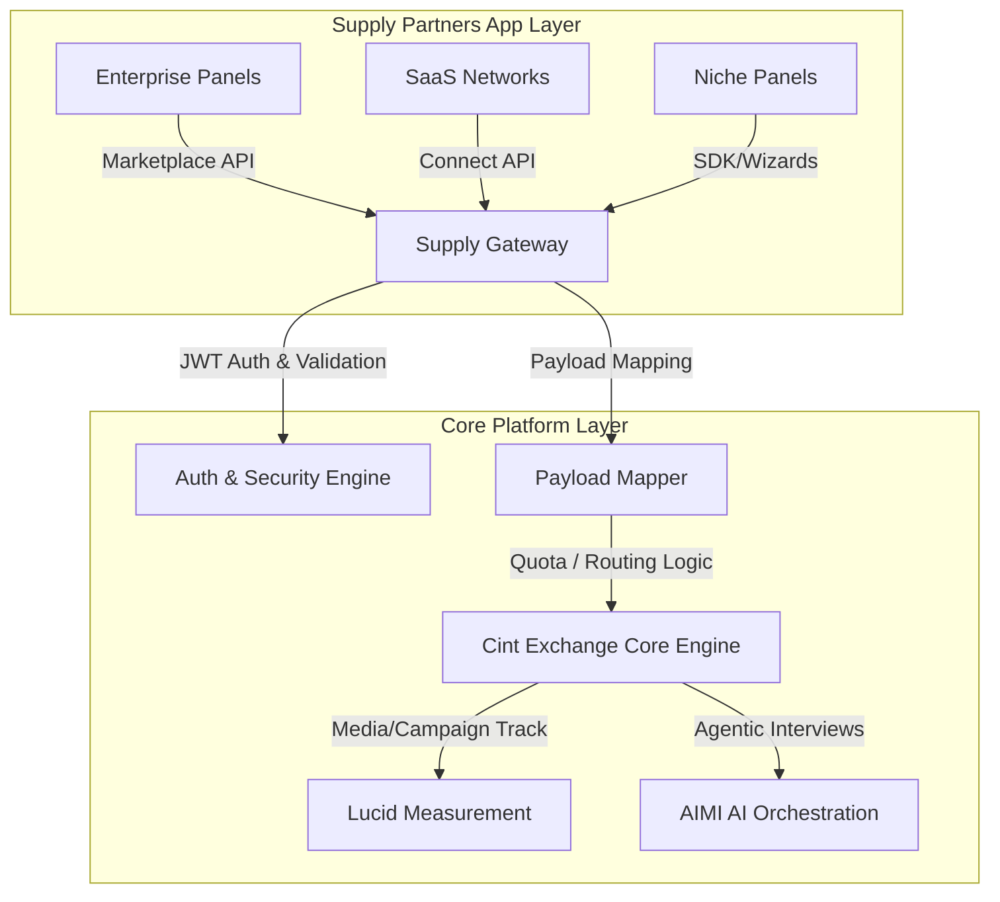

# Role Preparation Report: Senior Product Manager – Supply API (Cint)

## 1. Company Intelligence & Context

### Business Model & Scale
Cint Group AB operates the **Cint Exchange**, the world's largest programmatic research technology (ResTech) marketplace. The business model relies on charging transactional fees for connecting:
*   **Demand Side**: Brands, advertising agencies, and market researchers who build and run quantitative surveys or buy campaign measurement analytics.
*   **Supply Side**: Over 800 supply partners (consumer panel owners, loyalty program databases, and publishers) who monetize their members by matching them to paid survey opportunities.

With **EUR 150.44 million** in net sales (2025) and access to over **290 million respondents** across 130+ countries, Cint has massive scale.

### Moat & Strategy
*   **Two-Sided Network Effects**: The sheer volume of respondents on the supply side attracts massive survey buyers, which in turn generates higher monetization potential for panel suppliers, reinforcing Cint's market leadership.
*   **Consolidation under Cint 2.0**: The company is actively migrating legacy systems and its acquired Lucid Marketplace into a unified, consolidated platform, stabilizing cost bases and establishing a clean net cash position in 2026.
*   **AI Strategy (AIMI)**: Cint is moving toward "agentic market research" by integrating AI-Moderated Interviews (AIMI) directly into its marketplace, automating conversational qualitative follow-ups at quantitative scale.

---

## 2. Role Reality Check

### Spend-Rate (70-80% Reality Check)
*   **40% Developer Experience (DX) & Onboarding Optimization**: Driving self-serve tools, SDK design, and sandbox stability to speed up panel supplier integration cycles.
*   **30% API Governance, Versioning, and Performance**: Overseeing the deprecation of legacy routes (Lucid/Cint legacy endpoints) and designing stable API endpoints, webhooks, and error models on unified Cint 2.0 gateways (e.g. `api.samplicio.us`). Tackling latency and timeouts.
*   **10% Commercial Support & Partner Success**: Working with business development to resolve integration mismatches that impact panel payouts (e.g., resolving "ghost completes" or payload mapping errors).

### Success Metrics (3-6 Months)
1.  **Reduce Integration Time**: Decrease average supplier developer integration lifecycle (time-to-first-complete) by **30%** via improved docs and sandboxes.
2.  **API Stability**: Decrease programmatic payload/routing errors (SSL timeouts and parameter mismatches) by **25%**.
3.  **Deprecation Progress**: Successfully migrate **30%** of legacy supply partners onto the new consolidated Cint 2.0 endpoints.

### Flags & Vulnerabilities
*   **Financial Liabilities**: Supply integration bugs can directly result in payment discrepancies or loss of member yield. If Cint's APIs are hard to test, partners suffer financial damage, driving panel churn.
*   **Fragmented Documentation**: Merged endpoints mean developers often encounter mixed guides spanning legacy samplicio.us and Cint Connect portals, leading to configuration confusion.

---

## 3. 6-Month Proposals

### Proposal 1: Self-Serve Developer Portal & Sandbox Wizard
*   **Opportunity**: Current onboarding relies on manual key provisioning and Integration Consultant oversight. Simplifying this speeds up time-to-first-complete.
*   **Workstreams**: Build a self-serve panel sandbox, automate API credentials generation, and implement interactive testing mock payloads.
*   **Bridge Justification**: Candidate led the selection and implementation of Google Cloud Apigee and built Metro Bank's developer portal and sandbox from scratch.
*   **Success Metrics**: Onboarding lifecycle reduced from 21 days to under 3 days.
*   **Risks**: Mock responses must accurately mirror real production router behaviors to prevent false-positives.

### Proposal 2: Webhook Integrity Framework ("Ghost Complete Shield")
*   **Opportunity**: Discrepancies between Cint Exchange validation and partner platforms lead to unpaid finishes ("ghost completes"), causing panel frustration.
*   **Workstreams**: Implement a dynamic webhook validation engine, standardize mapping protocols for `cint_panelist_id` parameters, and build error-reporting alerts.
*   **Bridge Justification**: Candidate managed API design governance across all SWIFT external API channels, aligning complex messaging standards.
*   **Success Metrics**: Reduction in "ghost completes" by **80%** on integrated supplier accounts.
*   **Risks**: Modifying core payload validations could introduce minor routing latency if not optimized.

### Proposal 3: Unified Supply API SDK Wrappers
*   **Opportunity**: Supply partners have to write bespoke code to handle authentication and payload parsing. Off-the-shelf SDKs remove this barrier.
*   **Workstreams**: Release official client SDKs (Node.js, Python), publish open-source reference apps on GitHub, and document via OpenAPI specs.
*   **Bridge Justification**: Candidate managed developer teams using DevOps and automated testing (gulp.js, Jenkins), demonstrating strong software lifecycle governance.
*   **Success Metrics**: **40%** of new panels integrate using official SDKs.
*   **Risks**: Resource load to maintain SDK version parity during core platform updates.

---

## 4. Product Sense Deep Dive (5 Thinking Shifts)

### Shift 1: Strategic Context
programmatic research networks are highly transactional. Supply liquidity is time-critical; if panels experience API latency or security bottlenecks, they route traffic to competitors. Cint's API product strategy must focus on ease of developer integration, minimizing friction for panels while ensuring security and low-latency payload routing.

### Shift 2: Relationship Segmentation
We categorize supply partners based on volume and technical sophistication:

| Segment | Volume (Completes/mo) | API Maturity | Integration Style | Core Need |
|---|---|---|---|---|
| **Enterprise Panels** | 1M+ | High (Full Tech Team) | Direct Marketplace API | Custom rate-limits, OAuth 2.0 authorization, low-latency queues |
| **SaaS Networks** | 100k - 1M | Medium | Connect API / Webhooks | Clean developer documentation, reliable event triggers |
| **Regional Panels** | < 100k | Low | Off-the-shelf SDKs / Portals | Self-serve onboarding wizard, low-code integration |

### Shift 3: Architectural Distinction
We divide the product ecosystem into the App Layer (developer tools, integrations, SDKs) and the Core Platform Layer (matching routing, databases, authentication engine):



### Shift 4: Trust-by-Design
To secure programmatic panelist verification, we model a JSON Schema for panelist transaction authentication using JWT tokens and parameter structure validation:

```json
{
  "$schema": "https://json-schema.org/draft/2020-12/schema",
  "title": "CintPanelistAuthentication",
  "type": "object",
  "properties": {
    "cint_panelist_id": {
      "type": "string",
      "format": "uuid",
      "description": "Unique identifier of the panelist issued by Cint"
    },
    "cint_member_id": {
      "type": "string",
      "description": "Supplier-side panel member identifier"
    },
    "auth_token": {
      "type": "string",
      "description": "JWT validating transaction identity"
    },
    "payload": {
      "type": "object",
      "properties": {
        "email_hash_sha256": {
          "type": "string",
          "pattern": "^[a-fA-F0-9]{64}$"
        },
        "iso_country_code": {
          "type": "string",
          "minLength": 2,
          "maxLength": 2
        },
        "consent_status": {
          "type": "boolean"
        }
      },
      "required": ["email_hash_sha256", "iso_country_code", "consent_status"]
    }
  },
  "required": ["cint_panelist_id", "cint_member_id", "auth_token", "payload"]
}
```

### Shift 5: Growth Flywheels
We model supplier yield optimization ($Y$) as a function of matched quota volume ($Q$), conversion rate ($C$), and integration latency ($L$), showing that reducing API timeouts exponentially improves supplier monetization:

$$Y = Q \times C \times e^{-\lambda L}$$

Where $\lambda$ represents the latency decay coefficient. Decreasing API latency increases overall partner yield, cementing supplier retention and boosting the network effect.

---

## 5. Candidate Strategic Bridge

### Professional Summary
Technical Product Leader with over 15 years of experience building, governing, and scaling enterprise API platforms. Proven record in developer experience (DX), sandbox environments, and security architecture across SWIFT and Metro Bank Open Banking ecosystems. Twice certified on Google Cloud/Apigee, specializing in transforming complex transactional data flows into developer-friendly APIs.

### 3 Strategic Outcomes
*   **Outcome 1 (SWIFT)**: Led SWIFT Community API pilot (10 banks, 10 corporates), standardising transaction reporting APIs and reducing multi-bank cash reconciliation integration times. Translates to Cint’s challenge of consolidating fragmented supply integrations into a unified Exchange API.
*   **Outcome 2 (Metro Bank)**: Designed and delivered Metro Bank’s Open Banking API Developer Portal and sandbox from scratch on Apigee. Directly applies to Cint's need for self-serve supplier onboarding tools and sandbox infrastructure.
*   **Outcome 3 (Metro Bank)**: Built security infrastructure using OAuth/OpenID Hybrid Flow to handle third-party client identity in a highly regulated banking domain. Applies to securing Cint’s programmatic panelist data transactions.

### 5 Bridge Bullet Points
*   **API Platform Mastery**: Twice certified Apigee Gateway Architect with expertise in rate-limiting, error modeling, and traffic routing.
*   **Standards Governance**: Led cross-functional working groups with international standards bodies (ICC) to ratify trade data APIs, showing ability to align diverse supply partners.
*   **Technical Depth**: Bridged complex industry standards (ISO 20022) to practical JSON API designs, demonstrating a strong capability to handle complex panel schema transformations.
*   **DX Onboarding**: Outlined vision and managed supplier delivery for developer portals and sandbox tools, directly translating to panel supplier onboarding projects.
*   **Agile Team Leadership**: Managed developer teams using DevOps and automated testing (gulp.js, Jenkins), demonstrating strong software lifecycle governance.

---

## 6. Tailored Interview Questions

### For the Hiring Manager (Director of Product, Supply)
1.  *Cint 2.0 unifies the Lucid and Cint platforms. How do you balance feature parity for enterprise supply partners on legacy APIs against migrating them to consolidated endpoints?*
    > _What they're really testing: Experience managing technical debt and customer migration risk without losing supply liquidity._
2.  *Panel partners are highly sensitive to "ghost completes." How does the Supply PM role collaborate with the Demand team to enforce strict validation rules on buyers?*
    > _What they're really testing: Systems thinking across a two-sided marketplace and cross-functional team alignment._

### For the Engineering Lead
1.  *What is your preferred strategy for managing API version deprecation, particularly when dealing with third-party webhooks and asynchronous callback systems?*
    > _What they're really testing: Technical empathy and understanding of architectural trade-offs in distributed networks._
2.  *How do we handle transient SSL connection errors or timeouts on the supplier side without introducing excessive polling overhead on the Core engine?*
    > _What they're really testing: Designing resilient systems using circuit breakers, retries, and queue architectures._

### For Product Leadership (VP Product)
1.  *As we move toward "agentic market research" (like AIMI), how does the Supply API product roadmap shift to handle conversational audio/video payload streaming rather than structured survey redirects?*
    > _What they're really testing: Long-term vision and preparing core infrastructure for emerging tech vectors._
