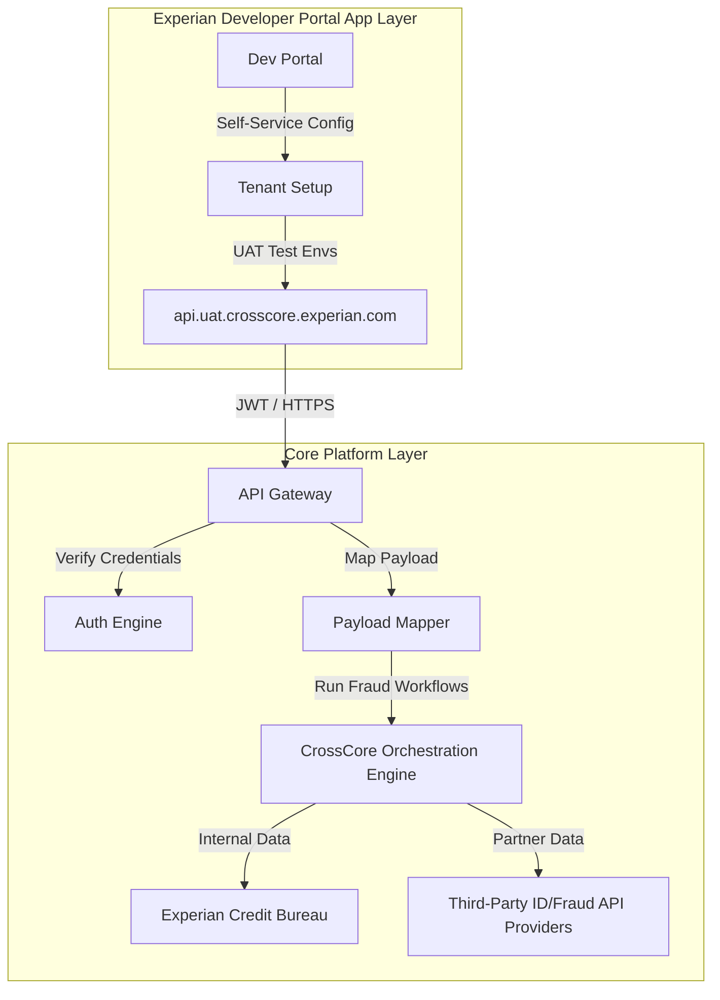

# Role Preparation Report: Senior Platform Product Manager – CrossCore (Experian)

## 1. Company Intelligence & Context

### Business Model & Scale
Experian is a global data analytics and decisioning giant. Its B2B segment accounts for **73%** of its **US$8.4 billion** revenue (FY2026). Experian operates as a global Fraud Prevention Agency (FPA), and **CrossCore** is its premier strategic digital identity and fraud orchestration platform. CrossCore operates under a transactional and recurring license-based SaaS model.

### Moat & Strategy
*   **Data and Network Moat**: Experian holds exclusive credit, public records, and fraud databases. CrossCore consolidates these internal assets alongside third-party fraud detection tools, locking clients (banks, retail, government) into their decisioning workflow.
*   **Orchestration Paradigm**: Instead of clients calling 10 separate APIs for ID checks, AML, device fingerprinting, and address validation, CrossCore serves as a single integration hub that coordinates the entire decision flow.
*   **AI Integration**: Experian is actively deploying machine-learning algorithms on CrossCore to defend against AI-fueled fraud vectors (like deepfakes and automated synthetic identity generation) that over **70% of enterprises** identify as an urgent threat.

---

## 2. Role Reality Check

### Spend-Rate (70-80% Reality Check)
*   **40% Third-Party Integrations & Partner Onboarding**: Leading technical integrations with external fraud and identity data providers. Optimizing partner onboarding through the Experian Developer Portal, managing JWT authentication and sandbox testing configs.
*   **30% API Product Lifecycle & Workflow Governance**: Managing RESTful APIs, version deprecations, UAT environments (`api.uat.crosscore.experian.com`), and ensuring latency remains low enough for real-time checkout decisions.
*   **10% Sales & Commercial Enablement**: Directly engaging with enterprise clients to identify platform requirements, partnering with legal on partner contract terms.

### Success Metrics (3-6 Months)
1.  **Reduce Integration Latency**: Keep overall decisioning workflow latency under **200ms** for active tenant integrations.
2.  **Partner Expansion**: Onboard and validate **3 new strategic third-party verification partners** onto the CrossCore catalog.
3.  **Onboarding Cycle**: Shorten the average developer time-to-first-UAT-transaction by **25%** through improved self-serve API resources.

### Flags & Vulnerabilities
*   **Compliance and Security Liability**: A single credential leak or integration flaw could expose sensitive PII. Tenant isolation and token expiration rules are high-stakes.
*   **Regulatory Friction**: Aligning data-sharing mechanisms with GDPR, FCRA, and local consumer rights mandates restricts product flexibility.

---

## 3. 6-Month Proposals

### Proposal 1: Self-Serve Partner Integration Wizard & UAT Sandbox
*   **Opportunity**: Currently, onboarding a third-party data provider requires significant integration support. Creating a self-serve partner sandbox speeds up verification.
*   **Workstreams**: Build mock tenant environments, publish open API schemas, and automate webhook testing suites.
*   **Bridge Justification**: Candidate designed and delivered Metro Bank’s Open Banking developer portal and sandboxes from scratch on Apigee.
*   **Success Metrics**: Partner time-to-market reduced from 6 weeks to under 10 days.
*   **Risks**: Security risk in allowing external code to trigger callbacks in shared test environments.

### Proposal 2: No-Code Identity Workflow Orchestrator (Schema Mapper)
*   **Opportunity**: Non-technical clients struggle to configure complex fraud routing policies. A visual, schema-mapped builder simplifies operations.
*   **Workstreams**: Build standard data-transfer payloads, configure rules-engine webhook endpoints, and map error formats.
*   **Bridge Justification**: Candidate managed API design governance for SWIFT's corporate channels, translating complex financial spec standards (ISO 20022) into practical designs.
*   **Success Metrics**: Decrease client-side configuration support tickets by **40%**.
*   **Risks**: Dynamic schema translation might introduce minor processing latency at high volumes.

### Proposal 3: Zero-Trust Tokenized Authorization Profiles
*   **Opportunity**: Traditional API keys are vulnerable to theft. Implementing dynamic, short-lived JWT token structures for client integrations improves platform trust.
*   **Workstreams**: Standardize JWT verification gates, configure tenant credential rotations, and secure callbacks.
*   **Bridge Justification**: Candidate implemented Open Banking security profiles using OAuth and OpenID Hybrid Flow with eIDAS certificates at Metro Bank.
*   **Success Metrics**: Zero security incidents related to credential theft on new integrations.
*   **Risks**: Integration overhead for clients transitioning from static API key configurations.

---

## 4. Product Sense Deep Dive (5 Thinking Shifts)

### Shift 1: Strategic Context
In digital identity, latency and accuracy are the ultimate trade-offs. If the CrossCore platform takes too long to validate a user (high latency), cart abandonment increases. If it is too loose, fraud losses spike. The strategic focus must be on maximizing throughput speed while enriching real-time data payloads.

### Shift 2: Relationship Segmentation
We segment integrations based on volume and data direction:

| Segment | Integration Type | Data Volume (Transactions) | Key Technical Need |
|---|---|---|---|
| **Enterprise Clients (e.g., Banks)** | Consumer (Outbound Calling) | 10M+ / month | Dedicated UAT tenants, custom firewall configs, static IP white-listing |
| **SaaS/E-commerce Merchants** | Consumer (Outbound Calling) | 100k - 1M / month | Low-latency REST endpoints, easy dev onboarding portal |
| **Verification Partners** | Provider (Inbound Data Feed) | Varies | Webhook endpoints, structured parameter mapping (UUIDs, sha256) |

### Shift 3: Architectural Distinction
We divide the platform architecture into the App Layer (developer tools, integrations, SDKs) and the Core Platform Layer (matching routing, databases, authentication engine):



### Shift 4: Trust-by-Design
To secure transactional data transfers, we model a JSON Schema for CrossCore identity verification payload validations:

```json
{
  "$schema": "https://json-schema.org/draft/2020-12/schema",
  "title": "CrossCoreIdentityRequest",
  "type": "object",
  "properties": {
    "tenant_id": {
      "type": "string",
      "format": "uuid",
      "description": "Unique Client Tenant Identifier"
    },
    "transaction_id": {
      "type": "string",
      "format": "uuid"
    },
    "token": {
      "type": "string",
      "description": "JSON Web Token (JWT) authorizing call"
    },
    "payload": {
      "type": "object",
      "properties": {
        "email_hash_sha256": {
          "type": "string",
          "pattern": "^[a-fA-F0-9]{64}$"
        },
        "ip_address": {
          "type": "string",
          "format": "ipv4"
        },
        "phone_number": {
          "type": "string"
        },
        "iso_country_code": {
          "type": "string",
          "minLength": 2,
          "maxLength": 2
        }
      },
      "required": ["email_hash_sha256", "ip_address", "iso_country_code"]
    }
  },
  "required": ["tenant_id", "transaction_id", "token", "payload"]
}
```

### Shift 5: Growth Flywheels
We model overall platform value yield ($Y$) as a function of fraud capture rate ($F$), user transaction volume ($U$), and API processing latency ($T$):

$$Y = F \times U \times e^{-\alpha T}$$

Where $\alpha$ represents the latency attrition coefficient. Lowering API latency preserves checkout conversions, encouraging higher transactional volume, which feeds more data back into the ML fraud models, enhancing the overall capture rate.

---

## 5. Candidate Strategic Bridge

### Professional Summary
Technical Product Leader with over 15 years of experience building, governing, and scaling enterprise API platforms. Proven record in developer experience (DX), sandbox environments, and security architecture across SWIFT and Metro Bank Open Banking ecosystems. Twice certified on Google Cloud/Apigee, specializing in transforming complex transactional data flows into developer-friendly APIs.

### 3 Strategic Outcomes
*   **Outcome 1 (SWIFT)**: Managed external API design governance and pilot programs (10 banks, 10 corporates). Standardized multi-bank transaction interfaces, which translates directly to aligning third-party data integrations on CrossCore.
*   **Outcome 2 (Metro Bank)**: Built Open Banking developer portals and UAT sandboxes from scratch on Apigee. Directly maps to Experian's need to optimize partner sandbox environments and onboarding documentation.
*   **Outcome 3 (Metro Bank)**: Designed secure API authorization models (OAuth, OpenID Connect) to validate third-party credentials. Translates to securing tenant logins and API transactions on CrossCore.

### 5 Bridge Bullet Points
*   **API Platform Mastery**: Certified Apigee platform architect; managed API routing, traffic limits, and error handling configurations.
*   **Security Acumen**: Designed OAuth and OpenID Connect profiles using eIDAS certificates for identity verification.
*   **Agile Team Leadership**: Managed a team of 6 API developers, implementing automated testing (gulp, Jenkins) and Scrum practices.
*   **Schema Expertise**: Translated complex business standards (ISO 20022) into practical JSON API schemas.
*   **Developer Advocacy**: Shipped webinars, portals, and onboarding guides to drive external partner API adoption.

---

## 6. Tailored Interview Questions

### For the Hiring Manager (Director of Product, CrossCore)
1.  *CrossCore relies on third-party integrations to orchestrate fraud decisions. How do you manage the product validation process for external data providers without creating bottleneck delays on the platform roadmap?*
    > _What they're really testing: Ability to scale a partner marketplace while maintaining control over software quality and platform roadmaps._
2.  *What are the current customer friction points in configuring workflows on CrossCore, and how is the team planning to simplify this for non-technical users?*
    > _What they're really testing: User-centric product thinking and vision for low-code/no-code interface integrations._

### For the Engineering Lead
1.  *How is tenant isolation maintained on the CrossCore API layer during high-volume periods, and what is your strategy for handling third-party API failures (timeouts, outages) in a synchronous workflow?*
    > _What they're really testing: Technical depth in multi-tenant architectures, circuit breakers, and fault-tolerance policies._
2.  *With JWT token validation in place, how do we handle key rotation and revocation for legacy integrations without causing client downtime?*
    > _What they're really testing: Pragmatic operations management in secure enterprise integrations._

### For Product Leadership (VP Product, Identity & Fraud)
1.  *With the rise of deepfakes and AI-generated fraud, how does the long-term vision of CrossCore adapt from simple static validation to real-time, behavioral, or context-aware AI assertions?*
    > _What they're really testing: Strategic vision for future-proofing fraud products in an AI-dominated threat landscape._
