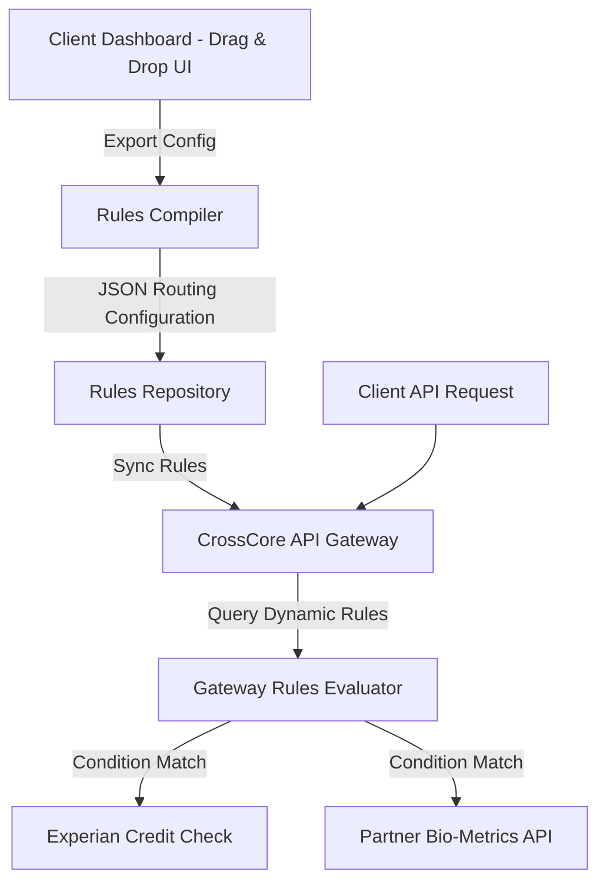

# Technical Specification: Workflow Engine

## System Layout


## Config Format Example
*   **Endpoint**: `POST /v1/workflows`
*   **Payload**:
```json
{
  "tenant_id": "8fa2b101-72f1-4db8-8422-9fa01201994a",
  "workflow_name": "Low-Risk Checkout Flow",
  "steps": [
    {
      "step_id": 1,
      "service": "experian_address_verify",
      "on_success": 2,
      "on_failure": "reject"
    },
    {
      "step_id": 2,
      "service": "partner_device_fingerprint",
      "conditions": [
        {
          "field": "risk_score",
          "operator": "LESS_THAN",
          "value": 40,
          "action": "approve"
        }
      ]
    }
  ]
}
```
