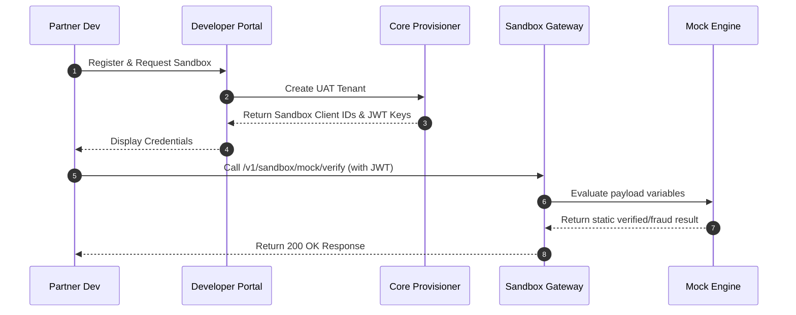

# Technical Specification: Self-Serve Sandbox

## Data Flow


## API Designs

### Create Sandbox Tenant
*   **Endpoint**: `POST /v1/sandbox/tenant`
*   **Request**:
```json
{
  "client_name": "Acme Risk Analytics",
  "developer_email": "dev@acme.com"
}
```
*   **Response**:
```json
{
  "tenant_id": "8fa2b101-72f1-4db8-8422-9fa01201994a",
  "sandbox_client_id": "sb_acme_99a8b1",
  "secret_key": "sec_sandbox_xyz123456"
}
```
