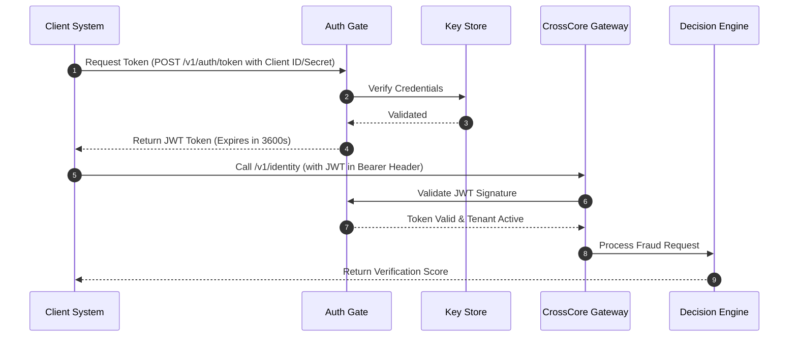

# Technical Specification: Zero-Trust Authorization

## Authorization Flow


## API Designs

### Request Access Token
*   **Endpoint**: `POST /v1/auth/token`
*   **Payload**:
```json
{
  "grant_type": "client_credentials",
  "client_id": "cc_client_1a98b1",
  "client_secret": "cs_prod_xyz987654321"
}
```
*   **Response**:
```json
{
  "access_token": "eyJhbGciOiJSUzI1NiIsInR5cCI6IkpXVCJ9...",
  "token_type": "Bearer",
  "expires_in": 3600
}
```
